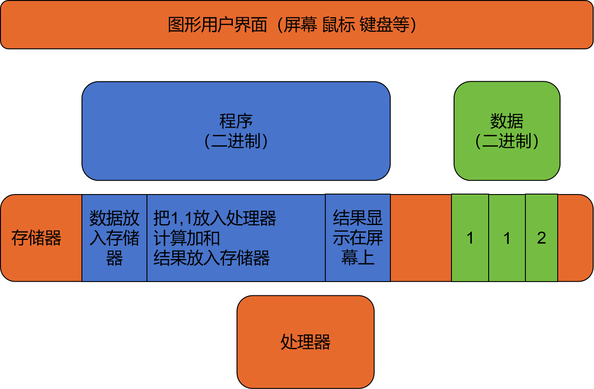

在开始学编程前，先了解一些计算机领域常用的概念和它们的关系。

# 一次简单的计算：1+1

现在的手机都是计算能力很强的计算机。使用手机的计算器app，按下“1+1=”键，可以看到出现结果“2”。
我们看看这个过程中计算机内部发生了什么。

## 计算流程

如图，1+1=2的计算过程为：

1. 将屏幕上点击的1和1放到存储器上
2. 计算1+1的和
   1. 将存储器上的1和1放入处理器
   2. 处理器计算加和为2
   3. 将2放入存储器
3. 将存储器中的2转换为屏幕上的图形2

# 一些概念

解释下上面提到的一些概念。

## 存储器和处理器

存储器像一张纸，可以放置一些信息。

1. 信息可以是1和2这样的数字，也可以是告诉处理器应该如何做计算的程序。
2. 这些信息是二进制的，即只有0和1。

处理器可以根据程序处理数据。处理器内部可以分为三个部分：

1. 放置数据的部分。
2. 做数据计算的部分，比如计算加减乘除。
3. 读取程序，控制数据流动和计算的部分。

存储器和处理器都是由半导体电路实现的，现在不需要了解它怎么做到的，等物理课学完电路后再了解。现在只需要了解它能做什么。

现在计算机计算能力很强，比如手机的处理器计算1+1=2这样的简单计算，可以每秒算1000000000000次（1万亿次）。
更复杂的应用，比如播放视频或电子游戏，背后都是这样简单计算的组合。

## 图形用户界面

计算机刚出现时，输入程序和数据很繁琐，只有少数人会使用。在使用过程中，工程师们把计算机和人交互的部分做的越来越好，先有了键盘可以输入字符，接着是鼠标和可以显示图形的屏幕，然后是可以触摸操纵的屏幕。每次交互方式更新，都让更多的人可以使用计算机。现在常用的处理器拥有每秒1万亿次的计算能力，而现在的图形用户界面让每个人都能使用这样的能力。

想一下，你会不会下面这几个技能，是什么时候学会的，花了多少时间：

1. 编写程序，处理二进制数据。
2. 掌握汉语拼音，会使用键盘打字。
3. 拿起一件物品，观察和触摸。

## 其他设备

除了上面介绍的，计算机还有一些其他设备：
比如硬盘，将程序和数据保存，因为存储器和处理器中的数据在断电后会丢失，而硬盘不会。还有网络设备，可以将程序或数据传输至另外一个计算机。

## 数字化信息

计算机只能处理二进制信息，不过各行各业的信息，都可以转换为数字化信息，并以二进制形式存储，从而可以被计算机处理。
如今数字化的内容已经非常多，可以观察身边见到的东西，其中大部分在被制造出来之前，总是先有一个数字化的模型。小到一只笔，大到一座大楼。或者很多内容就是纯数字化的，比如你现在看到的这些文字，以及平时看的视频、玩的电子游戏。

询问身边已经工作的人，问问他们所在行业有多少信息已经数字化了，计算机在工作中有什么作用？

## 语言

处理器只能识别二进制信息，所以程序需要使用二进制格式。直接用0/1写二进制程序过于繁琐，工程师们希望以更简单的方式描述计算过程，因此发明了各种编程语言。比如可以用数学公式的写法编程（c=a+b），然后转换为二进制程序运行。编程语言有很多种，是为了适应不同的编程需求，不同的语言在一些特性上有不同的侧重，比如：

1. 生成的二进制程序运行更快。
2. 完成一个功能，程序员用的时间更短。
3. 能运行在多种计算机上。

## 摩尔定律

当计算机被发明出来后，由于数据处理对人们的日常生活和各行各业都有帮助，计算机行业的需求日益增长，并获得了巨额的收入。这些收入又被投入到计算行业中，提升了处理器的计算速度，同时程序和能处理的数据变得更丰富，能满足更多的需求。在这样的不断循环下，计算机行业快速发展。
行业的快速发展在处理器上的表现是：相同价格能买到的处理器，每两年计算能力翻倍。这个现象已经持续超过50年。因为在50年前，戈登摩尔（现在常用的处理器Intel的创始人之一）做出过这个预测，因此这个现象叫摩尔定律。

注意，在各个行业中，都存在 投入资源-科技进步-生产力提升-产生更多回报-投入更多资源 这样不断循环提升生产力的过程。不过在最基础的能力上2年翻倍，持续超过50年，这不是一个普通的增长速度。
思考下如果其他行业也存在摩尔定律会发生什么，来感受下这个增长速度：

1. 假如水稻的亩产量每2年翻倍，持续50年？
2. 假如汽油的能量密度（锂电池同理）每2年翻倍，持续50年？
3. 假如钢铁的强度每2年翻倍，持续50年？

注：
1949年我国粮食平均亩产为68.6公斤，2018年达到374.7公斤。70年翻5倍。
http://www.moa.gov.cn/ztzl/70zncj/201909/t20190917_6328044.htm

锂电池商业应用后，能量密度从1991年的90Wh/kg到2023年的360Wh/kg，32年4倍。
https://www.iop.cas.cn/xwzx/kydt/202303/t20230324_6715050.html

当然，汽油和（固定成分的）钢铁作为物理材料无法提升其能量密度或强度，但不妨碍从科幻的角度想想这个问题。

# 总结

1. 半导体电路可以根据二进制程序处理二进制数据。
2. 数字，文字，图片等各行各业的信息可以转换为二进制数据。
3. 直接编写二进制程序效率很低，根据使用需求，有多种语言可以用来编程。
4. 图形用户界面让普通人，而不只是计算机从业者，使用计算机。既方便了人们的日常生活，也提升了各行各业的生产效率。
5. 在广泛的信息处理需求和计算机行业潜力下，计算机行业在过去的几十年快速发展。

# 附

有一个关于计算机行业更详细的介绍，并且有更多历史和应用的课程《Carrie Anne 计算机速成课》，时长为8小时，推荐观看。因为是英文+中文字幕视频，可以调整到合适的播放速度。遇到不懂的知识就跳过，主要看看各种概念和应用。
https://www.bilibili.com/video/BV1EW411u7th
